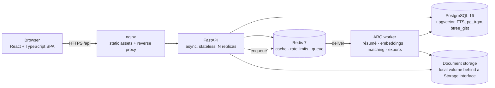
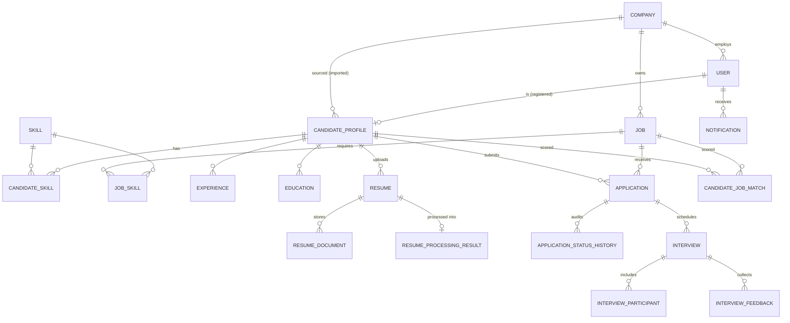
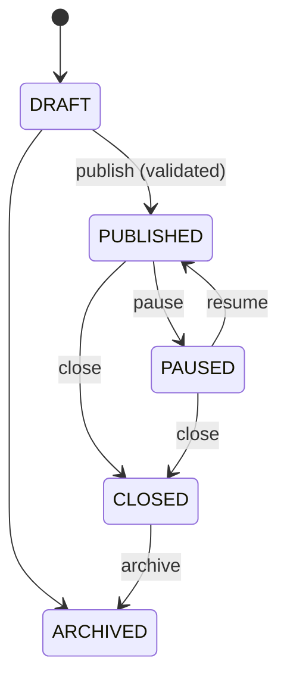
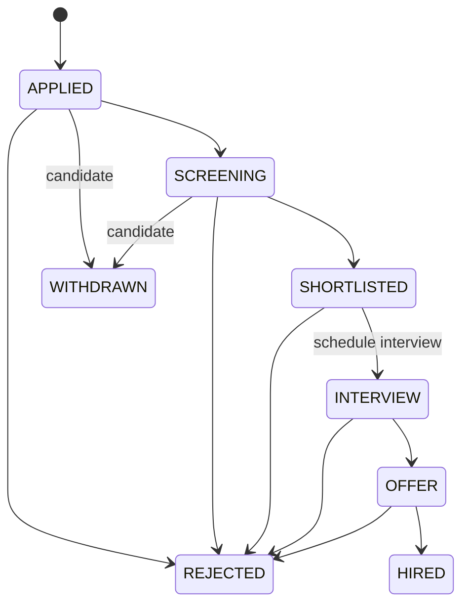

# TalentLens — Architecture

This document explains *how the system works and why it is built that way*. It is the document to read before a technical
discussion of the project. Evidence (measurements, evaluation, security checks) lives in `performance.md`,
`matching-evaluation.md`, `security-review.md` and `verification.md`.

## 1. System context



* **PostgreSQL is the only source of truth.** Business data, vectors (pgvector), full-text indexes and the *durable state of
  background tasks* all live there. Redis holds disposable state only; the system degrades (slower, no rate limiting, no
  caching) but stays correct when Redis is down.
* The API is stateless; any number of API/worker replicas can run. Long work never runs in a request: the API persists a
  task row, enqueues it, and returns `202` + a task id that the client polls (`GET /api/v1/tasks/{id}`).

## 2. Code layout (backend)

```
app/
├── api/             HTTP only: routes (thin), dependencies (auth, permissions, rate limits, pagination)
├── core/            settings (fail-closed in production), security (Argon2id, JWT, permission matrix), errors, logging
├── db/              async engine/session, models (one file per aggregate), enums (VARCHAR + CHECK, not PG enums)
├── schemas/         Pydantic request/response models — ORM objects are never returned from routes
├── services/        business rules, authorization, transactions (one service per aggregate)
│   └── access.py    ALL object-level authorization (tenant isolation, ownership, assignment, candidate visibility)
├── matching/        embedder, text representation, pure scoring, DB-backed service, evaluation harness
├── resume/          storage, file validation, text extraction, parsing, pipeline, task handlers
├── search/          job and candidate query builders (FTS + trigram + filters + vectors)
├── workers/         task executor (shared by ARQ and tests), dispatchers, ARQ worker + reaper + cron
├── cache/           Redis cache (versioned namespaces), rate limiter, token denylist — all fail-open
└── scripts/         bootstrap, demo seed
```

Rules that keep it maintainable: routes contain no business logic; services never import FastAPI; pure logic
(`matching/scoring.py`, `resume/parser.py`, state-machine tables) has no I/O and is unit-tested without a database;
**no route decides access** — services call `services/access.py`.

## 3. Data model



30 tables. Notable design choices:

* **UUID primary keys** (`gen_random_uuid()`): ids of candidates/applications are not enumerable.
* **Enums are `VARCHAR` + named `CHECK`** constraints (not native PG enums) so values can change with an ordinary migration.
* **Constraints are enforced by the database, not only by code:**
  `users.email` unique on `lower(email)`; `ck_users_staff_company` (recruiters/hiring managers must belong to a company);
  salary / experience / rating / date-order CHECKs; partial unique index *one live application per candidate per job*
  (`WHERE status <> 'WITHDRAWN'`); partial unique index on live duplicate postings; **GiST exclusion constraints** so a candidate
  or an interviewer can never be double-booked (`ex_interviews_candidate_no_overlap`, `ex_interview_participants_user_no_overlap`
  on `tstzrange`), which holds under concurrency where an application-level check cannot; `uq (job_id, candidate_id)` on matches;
  one primary résumé per candidate; unique `(user_id, dedupe_key)` on notifications; partial unique active `dedupe_key` on tasks.
* **Skills are structured**: `skills` (canonical, with a *loose key* so "Node.js/NodeJS/node js" collide), `skill_aliases`
  (Postgres → PostgreSQL), and a `family` (MySQL/PostgreSQL, React/Vue, …) used for related-skill partial credit.
* **Provenance of candidate data**: skills/experience/education/certifications carry `source` (`USER` | `RESUME`); résumé-derived
  skills additionally have `status` (`SUGGESTED` → `CONFIRMED`/`REJECTED`) and a confidence. Parser output never silently
  overwrites user input.
* **Candidate visibility is a first-class concept**: `candidate_profiles.source` (`SELF` registered, `IMPORTED` sourced by a
  company's bulk import) and `is_searchable` (marketplace opt-in). See §5.
* **Denormalised search/semantic columns** on `jobs` and `candidate_profiles`: `skills_text`, generated weighted `search_tsv`
  (GIN), `embedding vector(256)` (HNSW, cosine), `embedding_model/version/source_hash/generated_at`.
* `candidate_job_matches` stores component scores, the explanation JSON, `matching_version`, `embedding_model/version` and the
  *feature hashes* of the job and the candidate that produced the score — staleness is **detected**, not assumed.
* Timestamps are `timestamptz`; `updated_at` is server-maintained; `eager_defaults` makes SQLAlchemy fetch it in the same round trip.

## 4. Authentication

* **Passwords**: Argon2id; unknown e-mails are verified against a dummy hash so timing does not reveal account existence.
* **Access token**: JWT (HS256, explicit algorithm allow-list, required `exp/iat/sub/jti`), 15 minutes, sent as a Bearer header and
  held in memory by the SPA (never `localStorage`).
* **Refresh token**: 384-bit opaque random value, stored only as SHA-256, delivered in an `HttpOnly; SameSite=Strict; Path=/api/v1/auth`
  cookie (`Secure` in production). **Rotation with reuse detection**: each refresh invalidates the presented token and issues a new
  one in the same *family*; presenting an already-rotated token revokes the whole family (stolen-token containment).
* **Logout** revokes the family and denylists the access token's `jti` in Redis until it would have expired (best effort — the
  access token is short-lived and the refresh token, the long-lived credential, is revoked in PostgreSQL).
* Every request re-loads the user from PostgreSQL, so suspension and role changes take effect immediately.
* Brute force: per-IP login limiter + per-account failed-attempt counter; registration, upload, search and expensive endpoints
  have their own limits. All limiters fail open when Redis is unavailable.

## 5. Authorization

Two layers, both server-side:

1. **Coarse permission matrix** (`core/security.py`): role → permission set; enforced by route dependencies `require(Permission.X)`.
2. **Object-level rules** (`services/access.py`), applied again inside every service:
   * *Tenant boundary = company.* A recruiter can read/modify only their company's jobs, applications, interviews, reports.
     Resources of another tenant return **404** (not 403), so ids cannot be probed for existence.
   * *Hiring managers* see only jobs assigned to them (`jobs.hiring_manager_id`) and those jobs' applications; they review and give
     feedback but cannot change application stages.
   * *Candidates* see only their own profile, applications, interviews, résumés. They never see staff identities, internal notes,
     interview feedback or raw scoring internals.
   * *Candidate visibility for staff* (`CandidateAccess`): `FULL` (contact details + résumé file) for candidates who applied to the
     company or were sourced by it; `PROFILE` (skills/experience only, no contact, no files) for marketplace opt-ins; otherwise the
     candidate does not exist for that recruiter. Candidates control this with `is_searchable`.
   * Public job endpoints return only intentionally public fields (no recruiter ids, no internal notes).

## 6. Core workflows





Transitions are table-driven (`JOB_TRANSITIONS`, `applications.TRANSITIONS`), exhaustively unit-tested, and each application
transition writes an `application_status_history` row in the same transaction (the audit trail recruiters see; candidates see a
redacted view of it). Stage changes lock the application row (`SELECT … FOR UPDATE`) to serialise concurrent moves.

## 7. Background processing

**Why ARQ** (decision record): the API is asyncio-native; ARQ is an asyncio Redis queue, so the worker reuses the same async
services, sessions and cache code with no sync/async bridge. Celery brings a sync-first runtime, a broker abstraction and a lot of
operational surface for no benefit here; RQ is synchronous.

Task lifecycle (`background_tasks`, the source of truth; Redis only *delivers*):

1. API: `INSERT` task `PENDING` (dedupe key ⇒ at most one active task per key) → commit → enqueue → `202 {task_id}`.
2. Worker: `claim()` is an atomic `PENDING → RUNNING` update, so duplicate deliveries are harmless; progress/stage are written as
   the handler advances; a heartbeat key is refreshed every 10 s.
3. Terminal: `COMPLETED` (+result) or `FAILED` (+ safe `error_code`/message — never exception text or document content).
4. Retries: only `RetryableError` is retried, bounded by `TASK_MAX_ATTEMPTS` with back-off. Unknown exceptions are logged with a
   traceback and recorded as `INTERNAL_ERROR`; they are not retried.
5. Recovery: a reaper (cron, every 2 min) fails `RUNNING` tasks with no heartbeat and `PENDING` tasks whose queue message vanished.
6. Housekeeping crons: nightly match sweep (re-scores every published job so expired jobs drop out and missed refreshes are
   repaired) and cleanup of expired refresh tokens / old finished tasks.

If the queue is unreachable at enqueue time the task is marked `FAILED(QUEUE_UNAVAILABLE)` (user-initiated work returns 503;
derived-data refreshes after profile/job edits are skipped and rebuilt later) — a user's primary action is never lost because Redis
is down.

## 8. Résumé pipeline

```
upload ─► validate (size while streaming · extension · magic bytes · zip-bomb guard) ─► Storage.put (opaque key, atomic)
       ─► Resume(UPLOADED) + ResumeDocument ─► task PROCESS_RESUME ─► 202
worker: extract text (pypdf / python-docx, bounded, threaded) ─► parse (sections, contact, skills via ontology, experience,
        education, certifications, languages, years) ─► resolve skills ─► embed ─► ResumeProcessingResult + Resume(PROCESSED)
        ─► suggest skills on the candidate (SUGGESTED, never overwriting) ─► refresh candidate index ─► notify
```

Extraction failures (encrypted, malformed, empty/scanned — OCR is intentionally not enabled) end in `FAILED` with a safe code and a
notification; they never crash the worker or corrupt the candidate. Parsed data is stored as *suggestions with confidence*; the
candidate reviews, edits and applies them (`/resumes/{id}/extracted[/apply]`). Files are served only through an authorised endpoint,
never statically. Storage is behind a small `Storage` interface (local volume now; object storage later).

## 9. Semantic matching

### Representation
Both sides use the same three aligned components so titles are compared with titles, skills with skills, prose with prose:

| component | weight | job | candidate |
|---|---|---|---|
| role | 0.35 | title + level | headline + recent job titles |
| skills | 0.35 | required then preferred skill names | the candidate's non-rejected skills |
| prose | 0.30 | responsibilities + summary + qualifications (≤ 1800 chars) | summary + experience descriptions + certifications + education + résumé excerpt (≤ 1800 chars) |

The stored vector is the L2-normalised weighted sum of the component embeddings. Prose is truncated so a long résumé cannot drown
the structured signals; e-mails, URLs and phone numbers are stripped; **no name, gender, age, nationality, photo or other personal
attribute is ever part of the text**.

### Embeddings
`Embedder` protocol → default **WordLlama** (`wordllama-l2-supercat`, 256-d): pretrained token embeddings bundled in the PyPI wheel,
CPU-only, deterministic, offline, sub-millisecond per document. The model name/version is stored with every vector. An optional
sentence-transformers adapter exists (not exercised in CI: it needs a model download). `embedding_source_hash` makes re-embedding
idempotent.

**Changing the model:** (1) set `EMBEDDING_MODEL_NAME/EMBEDDING_VERSION` (or backend); (2) if the dimension differs, add a migration
altering the three `vector(N)` columns and rebuild the HNSW indexes (the column is `vector(256)` — `EMBEDDING_DIM` is validated against it);
(3) run **Admin → System monitoring → Models and matching → Re-embed stale items** (`REFRESH_EMBEDDINGS` task). Until a pair is re-scored its match row is *stale* (model/version/
hash mismatch) and is recomputed on read or by the nightly sweep — incompatible vectors are never mixed in one comparison.

### Score
`overall = Σ wᵢ·sᵢ / Σ wᵢ` over applicable components:

| component | weight | how |
|---|---|---|
| semantic similarity | 0.30 | calibrated cosine (anchors chosen from the labelled set, see `matching-evaluation.md`) |
| required skills | 0.30 | alias/canonical match = 1.0, same-family skill = 0.5, else 0 |
| preferred skills | 0.10 | same rule |
| experience | 0.15 | years vs. required range (below → proportional penalty; far above a stated maximum → mild penalty) |
| education | 0.05 | highest degree level vs. required minimum |
| preferences | 0.10 | workplace mode, location (skipped for remote jobs), employment type. Salary is deliberately *not* scored |

Components that do not apply (job lists no preferred skills; candidate gave no preferences) are removed and the weights
renormalised — missing data neither rewards nor punishes. A *qualification floor* caps the score at 0.45 when < 25 % of required
skills are covered. **It is a ranking aid for human reviewers, not a probability of being hired.**

### Retrieval, storage, freshness
Job → candidates: pgvector HNSW nearest-neighbour search restricted by SQL eligibility (marketplace opt-ins, the company's imported
candidates, applicants — applicants are always scored) → exact scoring → upsert into `candidate_job_matches`. Candidate → jobs: same
in reverse over live jobs. The recruiter UI reads stored rows (no inference on page load) and shows `stale_rows`; stale or missing
rows queue a deduplicated refresh. Triggers: publish, material job edit, profile/résumé change, new application, nightly sweep.

### Explainability
Each match stores a structured explanation (matched / related / missing required and preferred skills, experience status & text,
education status, semantic band, preference notes, summary sentence). Recruiters get the full breakdown; candidates get a subset
(`CandidateFacingMatch`: no weights, no raw cosine).

## 10. Search

| need | mechanism |
|---|---|
| structured filters | SQL `WHERE` + targeted B-tree/partial indexes (`ix_jobs_published`, `ix_jobs_company_status`, `ix_applications_*`) |
| keywords | `websearch_to_tsquery('english', q)` over a generated, weighted `tsvector` (title A, skills B, description C, dept/location D), GIN |
| typos / fragments | `pg_trgm` GIN on job title, location, candidate name/location; `%` operator + `similarity()` for ranking |
| skills | `EXISTS` on `job_skills` / `candidate_skills` (indexed `(skill_id, job_id|candidate_id)`), any-of / all-of |
| "who matches this job" | persisted semantic scores (`candidate_job_matches`) joined into the candidate query, sortable and filterable |

Nothing is filtered in Python; pagination is `LIMIT/OFFSET` with a separate `COUNT`. Plans and timings: `performance.md`.

## 11. Caching (Redis)

Keys embed a *namespace version* per domain, e.g. `cache:v1:search:jobs:jobs=12:<params-hash>`; a write does `INCR cache:ver:<domain>`,
instantly orphaning every dependent key (O(1), no `SCAN`/`DEL`, cannot miss a dependent key; TTLs reclaim the memory).

| cache | domains | TTL | invalidated by |
|---|---|---|---|
| public job search (anonymous / staff callers) | jobs | 60 s | any job write, publish/close/pause |
| skills list/autocomplete | skills | 600 s | skill create/edit |
| candidate recommendations (per candidate + filters + page) | matches, jobs, applications | 300 s | match refresh, job change, apply/withdraw |
| dashboards / reports | applications, interviews, jobs, matches | see reports | application/interview/job writes |

Personalised responses (a candidate's search with saved/applied flags) bypass the shared cache. Stale-data window = the TTL at worst;
the version bump makes it ~0 for the writers' own next read. Rate-limit counters and the `jti` denylist also live in Redis.
A shared **circuit breaker** skips Redis for 15 s after a failure so an outage costs one timeout, not one per request.

## 12. Observability

Structured JSON logs with `request_id` / `task_id` / `user_id` correlation (`X-Request-ID` echoed), request timing, auth failures
(warnings), authorization failures, task lifecycle, matching runs. Sensitive keys are redacted by the formatter; the code logs ids and
codes, never passwords, tokens, résumé text or contact details. Unexpected errors → one `ERROR` with traceback server-side and a
generic `INTERNAL_ERROR` to the client (no stack traces).

## 13. Key trade-offs

* **WordLlama vs. a transformer encoder.** Static embeddings are weaker on long, contextual text but are offline, reproducible,
  fast and dependency-light; the hybrid score compensates with structured skill/experience signals. The interface allows swapping.
* **Persisted scores vs. on-demand inference.** Precomputation makes recruiter pages instant and bounded but introduces staleness,
  handled with hashes/versions and background refresh.
* **404 for foreign tenants** hides existence at the cost of slightly less specific errors.
* **No e-mail delivery**: notifications are in-app (and idempotent); an SMTP sender would be one more task handler.
* **No OCR**: scanned résumés fail with an honest message rather than silently producing garbage.
